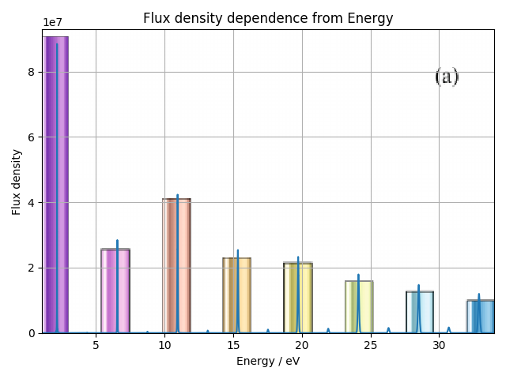
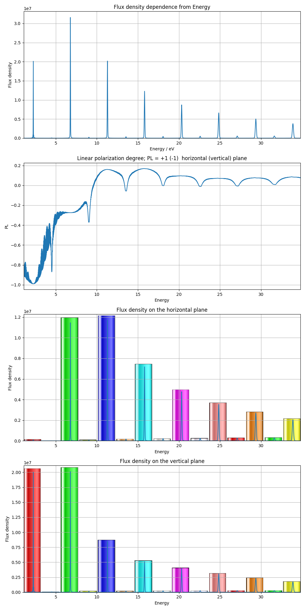

# Task 2

## Todo (UPD)
1. [x] Сравнить результаты, полученные в  [статье](../../docs/articles/Kalitenko-Zhukovskii2020_Article_RadiationFromEllipticalUndulat.pdf) в пунктах:

    1. "3. ANALYSIS OF THE EFFECT OF THE THIRD FIELD HARMONIC ON THE RADIATION OF A PLANAR TWO-FREQUENCY UNDULATOR";

    2. "5. ANALYSIS OF RADIATION OF A TWO-FREQUENCY ELLIPTICAL UNDULATOR".

   :exclamation: Ошибка в статье: некорректные графики. DELETED.

2. [x] Написать подпрограмму, разделяющую спектр на линейно поляризованные составляющие

3. [x] Сравнить результаты с другими параметрами, похожими на 1.2. [Аналитичекая модель.](../../docs/analytical/elliptic%20undul,%20sparc,%20d=d2=0,%20d1=1.pdf)

# Description
#### 1.1 Параметры установки:

Поле:

| Переменная   |      Значение      |
|--------------|:------------------:|
|  		|	297.26			|
|        |   2.1               |
|  		|	0				|
|  		|	2.2697 			|
|  		|	-1.22			|
|  	|	2.8 (cm)		|
| 		|	0.9e-3 			|
| 	|	2.5e-6 (m*rad)	|
| 	|	2.9e-6 (m*rad)	|
| 		|	2.2 (m)			|
| 		|	2.2 (m)			|
| L																				|	4.2 (m)			|

##### Результат 1.1

Результат сравнения представлен на рисунке ниже.

UPD: Изменились параметры длины и поля ондулятора.
По сравнению с предыдущим разом сходство увеличилось. Возможная причина различия - некорректные параметры ускорителя.

#### 3. Параметры установки:

Поле:

| Переменная   |      Значение      |
|--------------|:------------------:|
|       |   300                  |
|        |   2.133               |
|        |   0.711              |
|          |   1                |
|          |   0              |
|    |   2.8 (cm)        |
|       |   1e-3          |
|   |   2.5e-6 (m*rad)  |
|   |   2.9e-6 (m*rad)  |
|      |   2.2 (m)     |
|      |   2.2 (m)     |
| L                                                                             |   2.10 (m)        |

##### Описание 3.

Графики почти идентичны.