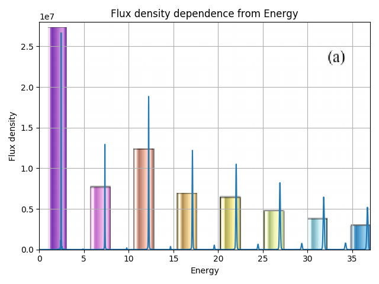
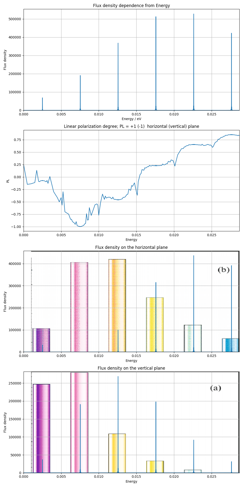

# Task
1. [x] Сравнить результаты, полученные в  [статье](../../docs/articles/Kalitenko-Zhukovskii2020_Article_RadiationFromEllipticalUndulat.pdf) в пунктах:

    1.1 "3. ANALYSIS OF THE EFFECT OF THE THIRD FIELD HARMONIC ON THE RADIATION OF A PLANAR TWO-FREQUENCY UNDULATOR";
    
    1.2 "5. ANALYSIS OF RADIATION OF A TWO-FREQUENCY ELLIPTICAL UNDULATOR".
2. [x] Написать подпрограмму, разделяющую спектр на линейно поляризованные составляющие

# Description
#### 1.1 Параметры установки:
Поле

| Переменная   |      Значение      |
|--------------|:------------------:|
|  		|	297.26			|
|  		|	0				|
|  		|	2.1 			|
|  		|	-1.22			|
|  	|	2.8 (cm)		|
| 		|	0.9e-3 			|
| 	|	2.5e-6 (m*rad)	|
| 	|	2.9e-6 (m*rad)	|
| 		|	2.2 (m)			|
| 		|	2.2 (m)			|
| L																				|	2.1 (m)			|

##### Описание 1.1

Результат сравнения представлен на рисунке ниже.

Графики схожи по поведению. Один параметр отличается от приведенных в статье (в статье L в 2 раза больше).

1.2 Параметры установки:
Поле

| Переменная   |      Значение      |
|--------------|:------------------:|
|  		|	11.8			|
|  		|	2.21622			|
|  		|	2.21622 		|
|  		|	0.3				|
|  		|	1				|
|  	|	2.3 (cm)		|
| 		|	0.9e-3 			|
| 	|	2.5e-6 (m*rad)	|
| 	|	2.9e-6 (m*rad)	|
| 		|	0.37 (m)		|
| 		|	0.37 (m)		|
| L																				|	3.45 (m)		|

##### Описание 1.2

Результат сравнения представлен на рисунке ниже.

:exclamation: Графики cильно отличаются от аналитически построенных. Скорее всего график суммы по поляризациям так же отличается от численной модели.