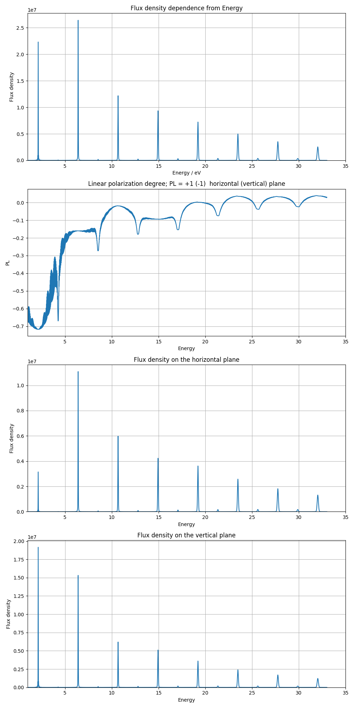
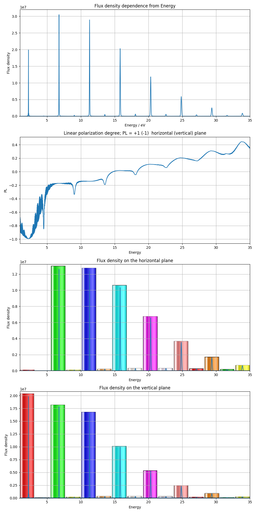
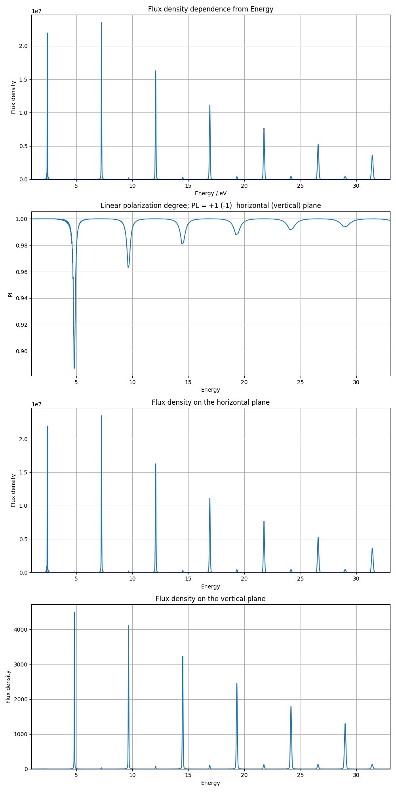
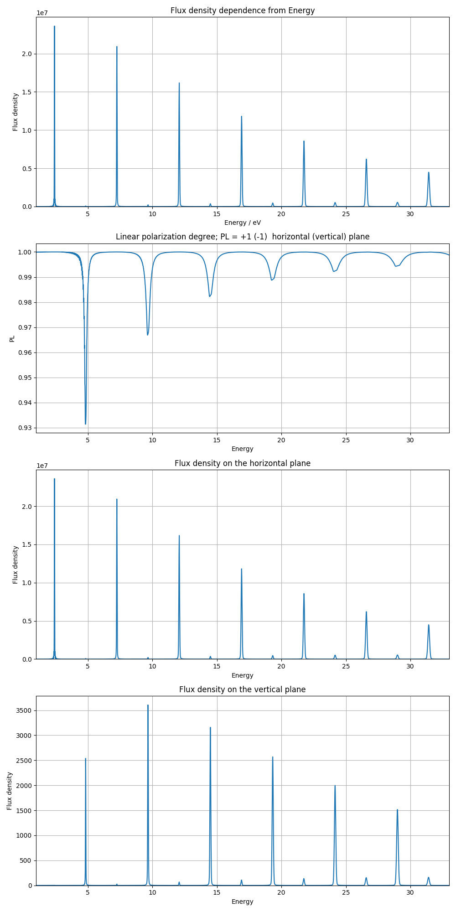
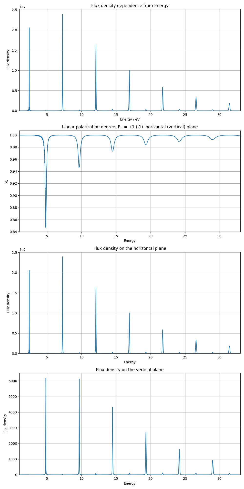
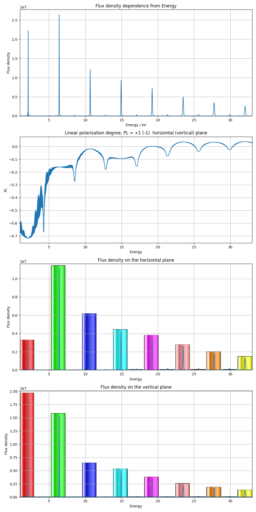

# Task 3

## Todo
1. [x] Посмотреть конфигурацию с .
2. [x] Сравнить результаты, с [аналитической моделью](../../docs/analytical/UNDULATOR%20FIELD%20Cos(3zk_u).doc).
3. [x] Конфигурация плоский sin cos.
4. [x] Конфигурация плоский cos cos.
5. [x] Конфигурация плоский sin sin.
6. [x] Сравнить результаты, с [аналитической моделью](../../docs/analytical/elliptic%20undul,%20SPARC%20setup,%20d=0,%20d1=1,%20d2=0.3%20v.2.doc).

# Description
#### 3.1. Параметры установки:

Поле:

| Переменная   |      Значение      |
|--------------|:------------------:|
|       |   300                  |
|        |   2.133               |
|        |   2.133               |
|        |   0.956553              |
|          |   1                |
|          |   5                |
|          |   3                |
|          |   1                |
|          |   -0.3              |
|          |   0              |
|    |   2.8 (cm)        |
|       |   1e-3          |
|   |   2.5e-6 (m*rad)  |
|   |   2.9e-6 (m*rad)  |
|      |   2.2 (m)     |
|      |   2.2 (m)     |
| L                                                                             |   2.10 (m)        |

##### Результат 3.1.

#### 3.2. Параметры установки:
Вид поля тот же, что и в 3.1.

| Переменная   |      Значение      |
|--------------|:------------------:|
|       |   300                  |
|        |   2.133               |
|        |   2.133               |
|        |   0.711              |
|          |   1                |
|          |   5                |
|          |   3                |
|          |   0                |
|          |   1              |
|          |   0              |
|    |   2.8 (cm)        |
|       |   1e-3          |
|   |   2.5e-6 (m*rad)  |
|   |   2.9e-6 (m*rad)  |
|      |   2.2 (m)     |
|      |   2.2 (m)     |
| L                                                                             |   2.10 (m)        |

##### Результат 3.2

#### 3.3 Параметры установки:
Вид поля тот же, что и в 3.1., т.е:

| Переменная   |      Значение      |
|--------------|:------------------:|
|       |   300                  |
|        |   2.133               |
|        |   0               |
|        |   2.14364              |
|          |   1                |
|          |   1                |
|          |   3                |
|          |   1                |
|          |   0.3              |
|          |   0              |
|    |   2.8 (cm)        |
|       |   1e-3          |
|   |   2.5e-6 (m*rad)  |
|   |   2.9e-6 (m*rad)  |
|      |   2.2 (m)     |
|      |   2.2 (m)     |
| L                                                                             |   2.10 (m)        |

##### Результат 3.3

#### 3.4 Параметры установки:
Поле

| Переменная   |      Значение      |
|--------------|:------------------:|
|       |   300                  |
|        |   2.133               |
|        |   0               |
|        |   2.14364              |
|          |   1                |
|          |   1                |
|          |   3                |
|          |   1                |
|          |   0.3              |
|          |   0              |
|    |   2.8 (cm)        |
|       |   1e-3          |
|   |   2.5e-6 (m*rad)  |
|   |   2.9e-6 (m*rad)  |
|      |   2.2 (m)     |
|      |   2.2 (m)     |
| L                                                                             |   2.10 (m)        |

##### Результат 3.4

#### 3.5 Параметры установки:
Поле

| Переменная   |      Значение      |
|--------------|:------------------:|
|       |   300                  |
|        |   2.133               |
|        |   0               |
|        |   2.14364              |
|          |   1                |
|          |   1                |
|          |   3                |
|          |   1                |
|          |   0.3              |
|          |   0              |
|    |   2.8 (cm)        |
|       |   1e-3          |
|   |   2.5e-6 (m*rad)  |
|   |   2.9e-6 (m*rad)  |
|      |   2.2 (m)     |
|      |   2.2 (m)     |
| L                                                                             |   2.10 (m)        |

##### Результат 3.5

##### 3.6. Параметры установки:

Поле:

| Переменная   |      Значение      |
|--------------|:------------------:|
|       |   300                  |
|        |    2.133               |
|        |   0.956553              |
|    |   2.8 (cm)        |
|       |   1e-3          |
|   |   2.5e-6 (m*rad)  |
|   |   2.9e-6 (m*rad)  |
|      |   2.2 (m)     |
|      |   2.2 (m)     |
| L                                                                             |   2.1 (m)        |

##### Результат 3.6
