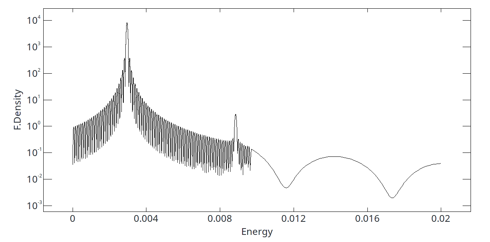
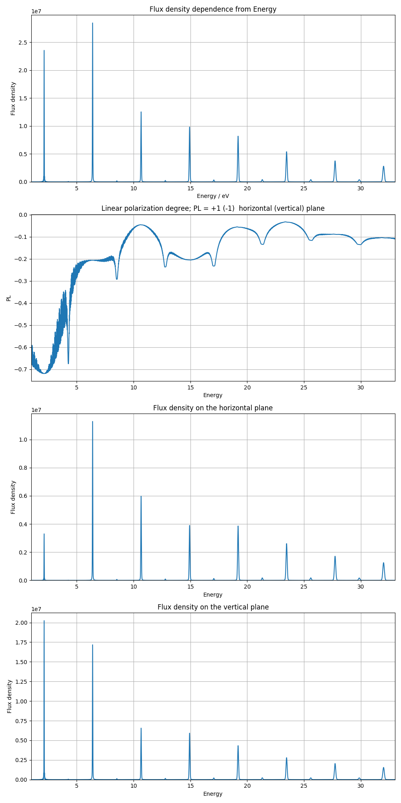

# Task 4

[[_TOC_]]

## TODO:

1. [ ] Провести анализ погрешностей;
2. [x] KAERI  [Статья с Калитенко](../../docs/articles/Kalitenko-Zhukovskii2020_Article_RadiationFromEllipticalUndulat.pdf) пункт 4;
3. [x] SPARK H=(sin(x)-sin(5x),cos-sin,0).

## Description

### 4.2. Анализ погрешностей.

Уточнение деталей реализации.

### 4.2. Эксперимент KAERI

Поле:

#### Ускоритель

| Переменная             | Значение | Переменная     | Значение |
|------------------------|:--------:|----------------|:--------:|
|  $`\gamma`$*           | 12.72    | $`\sigma`$     | 1e-3     |
|  $`E`$, MeV            | 6.5      | $`\beta_x`$, cm| 43.66    |
|  $`\epsilon_x`$, m*rad | 2.5e-6   | $`\beta_y`$, cm| 28.75    |
|  $`\epsilon_y`$, m*rad | 2.9e-6   | $`\alpha_x`$   | 2.223    |
|  $`I_{peak}`$, A       | 15.95    | $`\alpha_y`$   | 1.053    |

#### Ондулятор

|   Переменная    | Значение | 
|-----------------|:--------:|
|$`\lambda_u`$, cm| 2.3      | 
|L*, cm           | 69       |
|$`N_u`$          | 30       |
|$`K_{0}`$        | 2.21622  |
|$`K_{Eff_x}`$*   | 2.21706  |
|$`K_{Eff_y}`$*   | 2.21706  |

\* вычисленные величины

##### Результат 4.2.

### 4.3. Эксперимент SPARK

Поле:

#### Ускоритель

| Переменная             | Значение | Переменная     | Значение |
|------------------------|:--------:|----------------|:--------:|
|  $`\gamma`$            | 300      | $`\sigma`$     | 1e-3     |
|  $`E`$*, MeV           | 153.29969| $`\beta_x`$, m | 2.2      |
|  $`\epsilon_x`$, m*rad | 2.5e-6   | $`\beta_y`$, m | 2.2      |
|  $`\epsilon_y`$, m*rad | 2.9e-6   | $`\alpha_x`$   | 0        |
|  $`I_{peak}`$, A       | 7.97     | $`\alpha_y`$   | 0        |

#### Ондулятор

|   Переменная    | Значение | 
|-----------------|:--------:|
|$`\lambda_u`$, cm| 2.8      | 
|L*, m            | 2.1      |
|$`N_u`$          | 75       |
|$`K_{0}`$        | 2.133    |
|$`K_{Eff_x}`$*   | 2.134706 |
|$`K_{Eff_y}`$*   | 0.956553 |

\* вычисленные величины

##### Результат 4.3.
